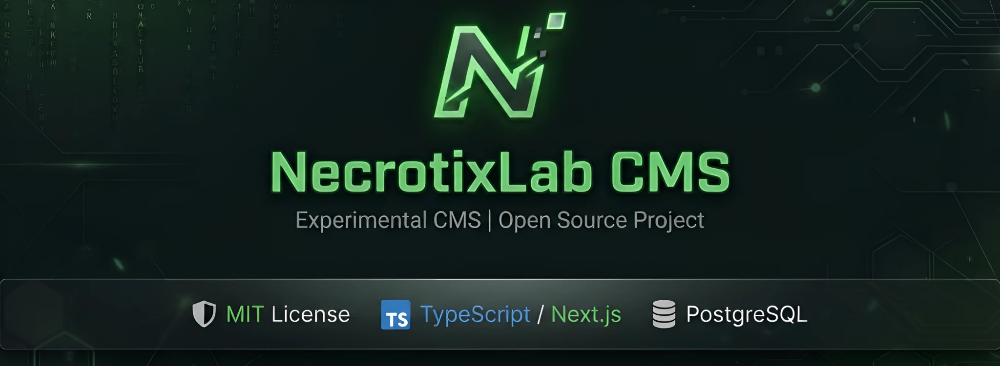
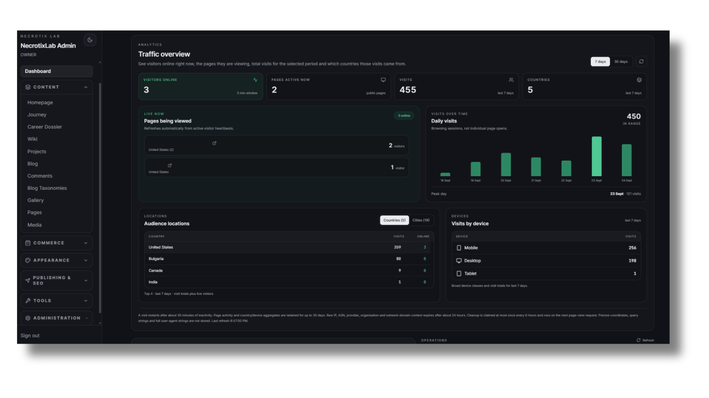
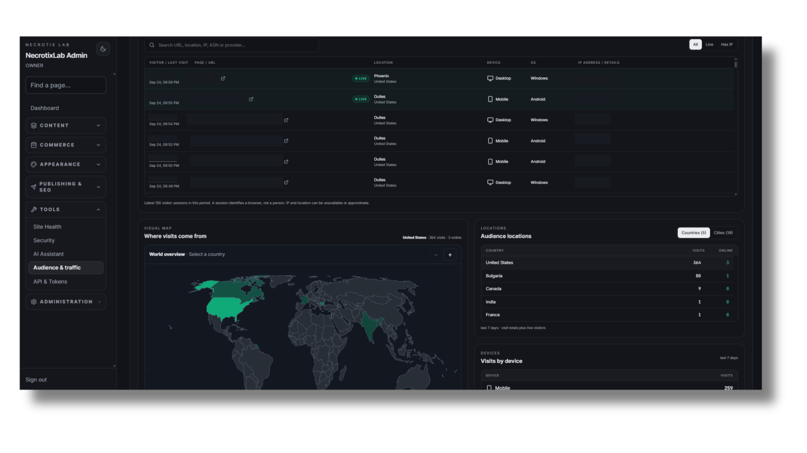
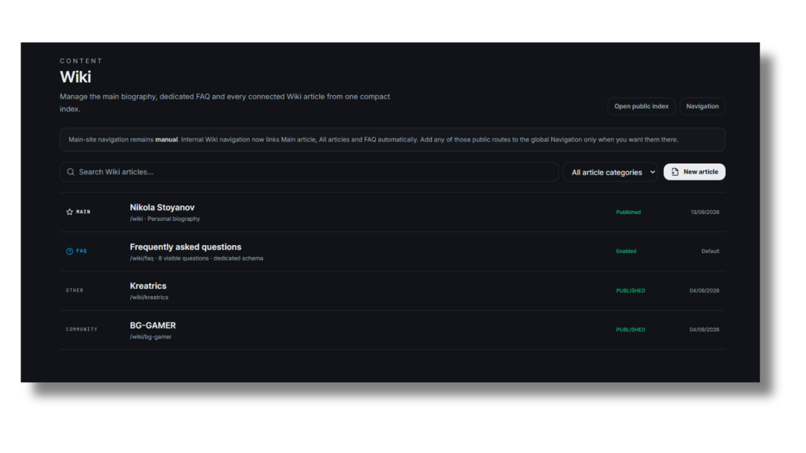
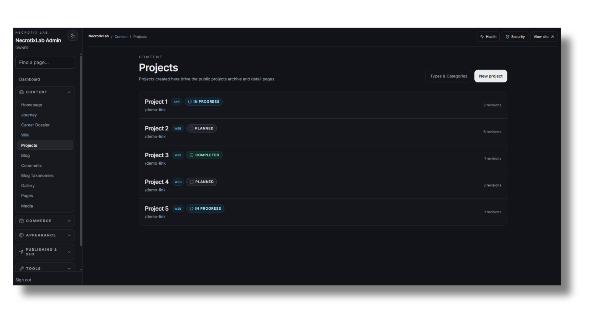
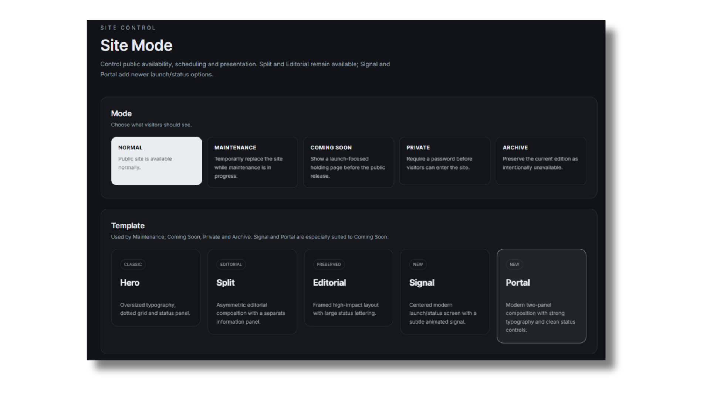
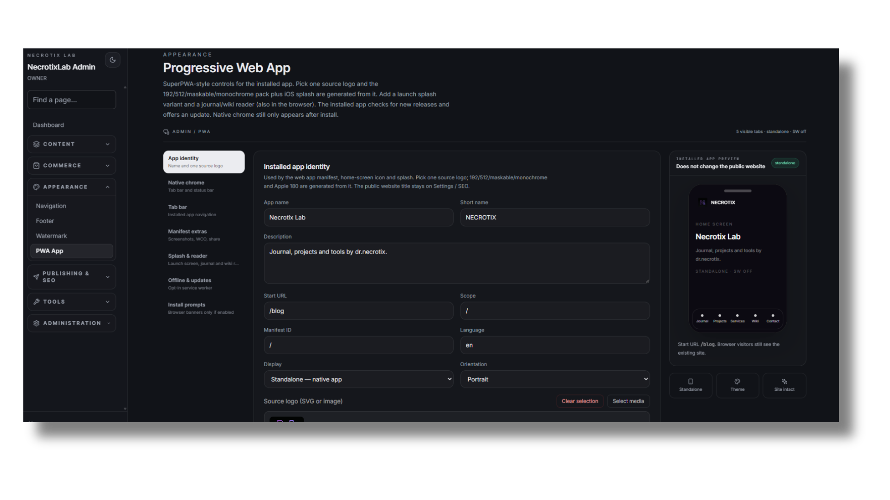
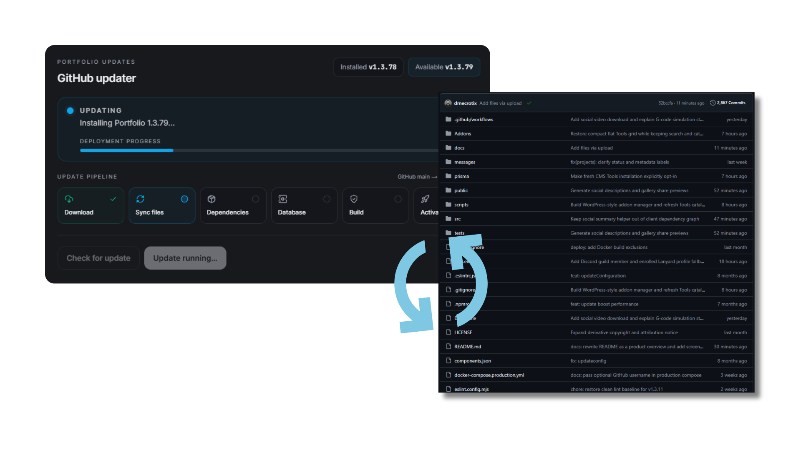
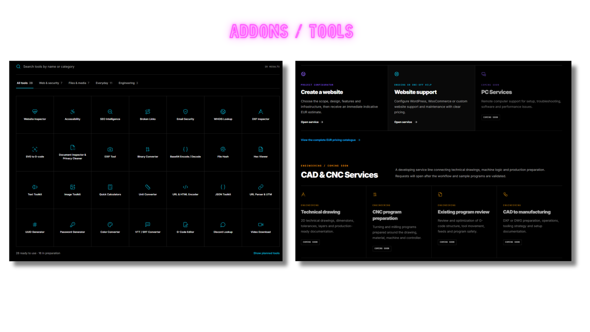

<div align="center">



# NecrotixLab CMS

**An open-source CMS and digital lab for publishing, projects, services and modular tools.**

[](https://github.com/drnecrotix/NecrotixLab/actions/workflows/ci.yml)
[](LICENSE)
[](https://nextjs.org/)
[](https://www.typescriptlang.org/)

[Live site](https://necrotixlab.com) · [Documentation](docs/wiki/Home.md) · [Installation](docs/wiki/Requirements.md) · [Addons guide](docs/wiki/Addons.md) · [Contribute](#contributing)

</div>

## Product

NecrotixLab is a self-hosted CMS for people who ship a public brand and the operations behind it from the same codebase. One Next.js app serves the site visitors see and the admin you work in. Content, media, projects, services, commerce and site controls live in PostgreSQL — not in a pile of disconnected plugins.

It is the system behind [necrotixlab.com](https://necrotixlab.com): journal and wiki publishing, a project archive, service pages, a tools catalogue, PWA install, and a GitHub-connected updater. Use the defaults, or extend the lab with themes and addons.

The project is experimental and in active development. Read the [release notes](docs/releases/) and deployment requirements before you upgrade a production install.

## Overview
<div align="center">
Admin, operations, and the public tools surface — the product as it runs today.

<p align="center"><strong>Analytics dashboard</strong> — live visitors, pages in view, traffic and audience location.</p>



<p align="center"><strong>Audience &amp; traffic</strong> — session list, world map and device breakdown from the same operations desk.</p>



<p align="center"><strong>Wiki</strong> — biography, FAQ and connected articles from one compact index.</p>



<p align="center"><strong>Projects</strong> — portfolio items with type, status and revision history that drive the public archive.</p>



<p align="center"><strong>Site mode</strong> — Normal, Maintenance, Coming Soon, Private or Archive, each with a dedicated holding template.</p>



<p align="center"><strong>Progressive Web App</strong> — name, icons, splash, start URL and standalone chrome without changing the public site.</p>



<p align="center"><strong>GitHub updater</strong> — pull from <code>main</code>, sync files, migrate, build and activate with a visible pipeline.</p>



<p align="center"><strong>Tools &amp; Addons</strong> — public utilities and service catalogue, managed as an installable addon rather than hardcoded pages.</p>


</div>
## Why this CMS

- **One product, two surfaces.** Public site and protected admin share the same Next.js application, design system and data model.
- **Built for a lab, not a brochure.** Publishing, portfolio, services, commerce, analytics and site modes sit next to each other instead of behind extra platforms.
- **Operations are first-class.** Live audience, health, security and a GitHub → production updater are part of the CMS, not an afterthought.
- **Installable as an app.** SuperPWA-style controls generate icons, splash screens and a standalone shell from one source logo.
- **Extend without forking first.** Themes and addons live beside the core. The Tools collection is an addon you opt into.
- **Honest about the runtime.** This is a Node server with a database. It is not a static export and it will not run on PHP-only hosting.

## What's included

| Area | What you get |
| --- | --- |
| Publishing | Journal, custom pages, Wiki, comments, scheduling, revisions and SEO metadata |
| Portfolio | Projects and case studies, gallery, media library and homepage sections |
| Services | Service pages, request flows, pricing configuration and monitoring |
| Commerce | Digital products, private downloads, orders and optional payment integrations |
| Operations | Dashboard, audience analytics, site health, security settings and updater |
| Appearance | Navigation, footer, site modes, PWA settings and watermarks |

The public **Tools** collection is the **Tools addon**. A fresh install does not activate it. Admins install and configure it from **Admin → Addons**. Source lives under [`Addons/`](Addons/), separate from CMS modules.

> Current addon boundary: ZIP imports validate and stage packages. New executable addon routes require a reviewed CMS build; uploading a ZIP alone does not run arbitrary server code. See the [Addons guide](docs/wiki/Addons.md).

## Who it is for

- Independent studios and personal brands that want a public site plus a real admin, not a page builder.
- Labs that publish writing, ship projects, sell digital work and run small service funnels in one place.
- Operators who want live traffic, site modes and a GitHub-backed update path without stitching five SaaS dashboards.

## Stack

- Next.js 16, React 19, TypeScript and Tailwind CSS
- PostgreSQL and Prisma
- Auth.js, server actions and API routes
- Tiptap for rich content
- Node test runner, ESLint, TypeScript checks and Playwright
- Optional S3-compatible storage, SMTP and payment integrations

## Get started locally

**Requirements:** Node.js 22, npm and PostgreSQL 14+ ([full requirements](docs/wiki/Requirements.md)).

```bash
git clone https://github.com/drnecrotix/NecrotixLab.git
cd NecrotixLab
npm ci
cp .env.example .env.local
```

On Windows PowerShell, use `Copy-Item .env.example .env.local` instead of `cp`. Set at least `DATABASE_URL`, `AUTH_SECRET`, `OWNER_EMAIL`, `OWNER_PASSWORD` and `NEXT_PUBLIC_SITE_URL` in `.env.local`. Use your own owner identity and strong secrets; never commit that file.

```bash
npm run db:migrate
npm run db:seed
npm run dev
```

Open `http://localhost:3000` for the site and `http://localhost:3000/admin` for the CMS. For a production server use `npm run db:deploy` and the matching [N0C](docs/wiki/Installation-N0C.md), [cPanel](docs/wiki/Installation-cPanel.md) or [home server](docs/wiki/Installation-Home-Server.md) guide. Run `npm run production:preflight` before a production build.

## Addons

The admin Addons page has **Available**, **Installed** and **Add New** views. The catalogue reads addon manifests from the GitHub `Addons/` directory. A package may be installed from its published archive or uploaded as a ZIP. Each addon has a separate folder and `manifest.json`; compatible Tools functionality can be activated and configured in its own settings page.

For the package format, versioning, GitHub publishing steps and current execution limits, read [Create and install an Addon](docs/wiki/Addons.md).

## Development and verification

```bash
npm run typecheck
npm run lint
npm run test:unit
npm run build
```

`npm run build:n0c` is available for supported shared-host environments where native SWC cannot run. Run `npm run test:visual` when changing responsive UI. CI also validates production builds, updater behavior and deployment-sensitive changes.

## Documentation

- [Wiki index](docs/wiki/Home.md) and [Admin Dashboard](docs/wiki/Admin-Dashboard.md)
- [Requirements](docs/wiki/Requirements.md) and [Troubleshooting](docs/wiki/Troubleshooting.md)
- [Addons: create, publish and install](docs/wiki/Addons.md)
- [Updates and CI](docs/wiki/Updates-and-CI.md)
- [License and credits](docs/wiki/License-and-Credits.md)

## Contributing

Issues and focused pull requests are welcome. Create a branch from `main`, keep unrelated changes separate, and run the relevant checks before opening a PR. For addon contributions, follow the manifest and packaging rules in the [Addons guide](docs/wiki/Addons.md). Never include credentials, private customer data or production uploads in a PR.

## License and attribution

NecrotixLab is licensed under [MIT](LICENSE). The original PersonalBlog copyright notice by S. A. Almazril is retained. See [License and Credits](docs/wiki/License-and-Credits.md) for attribution and redistribution details. Third-party integrations remain subject to their own terms.
